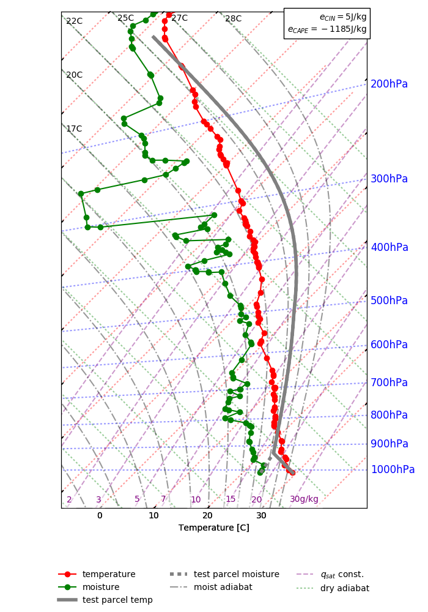

# Python package for plotting tephigrams


## Prerequisites

matplotlib and numpy.

## Usage
```
from tephigram_python import Tephigram

tephigram = Tephigram()

sounding = np.loadtxt('sounding_example.dat', unpack=True)
P = sounding[0]
T = sounding[2]
T_dp = sounding[3]
RH = sounding[4]/100.

tephigram.plot_sounding(P=P, T=T, T_dp=T_dp)
tephigram.plot_legend()
parcel_info = tephigram.plot_test_parcel(z=z, P=P, T=T, RH=RH)

tephigram.savefig('tephigram_example.png')
```

`parcel_info` variable contains the test parcel's CAPE (Convectively Available
Potential Energy) and CIN (Convective Inhibition energy) as well as the LCL
(Lifting Condensation Level), LFC (Level of Free Convection) and EL



Other useful methods of `Tephigram` include `plot_temp` and `plot_RH`.
(Equilibrium Level).

See [tests/](tests/) for more usage examples.

## TODO
- add to pypi and add pip instructions

## Sources of inspiration

- [Tephigram Mastery](https://www.meted.ucar.edu/mesoprim/tephigram/)
- [Basic IDL routines for atmospheric science applications](http://www.iac.ethz.ch/staff/dominik/idltools/idl_atmosphys.html)
- [Atmospheric Thermodynamics - Peter Bechtold](https://old.ecmwf.int/newsevents/training/lecture_notes/pdf_files/PARAM/Atmospheric_Thermodynamics.pdf)
