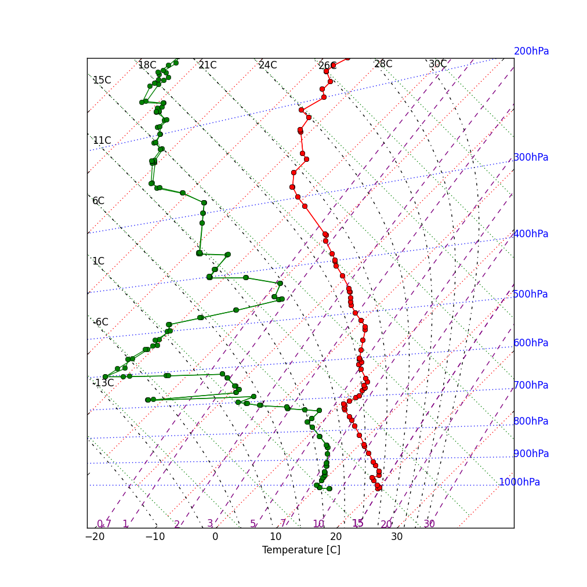

# Python package for plotting tephigrams

## Prerequisites

matplotlib and numpy.

## Usage
```
from tephigram_python import Tephigram

tephigram = Tephigram()

sounding = np.loadtxt('sounding_example.dat', unpack=True)
P = sounding[0]
T = sounding[2]
T_dp = sounding[3]

tephigram.plot_sounding(P=P, T=T, T_dp=T_dp)
tephigram.plot_legend()

tephigram.savefig('tephigram_example.png')
```




Other useful methods of `Tephigram` include `plot_temp` and `plot_RH`.

## TODO
- calculation and plotting of:
    - LCL: Lifting Condensation Level
    - FLC: Free Convection Level
    - CAPE: Convectively Available Potential Energy
    - EL: Equilibrium Level
- add to pyp and add pip instructions

## Sources of inspiration

- [Tephigram Mastery](https://www.meted.ucar.edu/mesoprim/tephigram/)
- [Basic IDL routines for atmospheric science applications](http://www.iac.ethz.ch/staff/dominik/idltools/idl_atmosphys.html)
- [Atmospheric Thermodynamics - Peter Bechtold](https://old.ecmwf.int/newsevents/training/lecture_notes/pdf_files/PARAM/Atmospheric_Thermodynamics.pdf)
